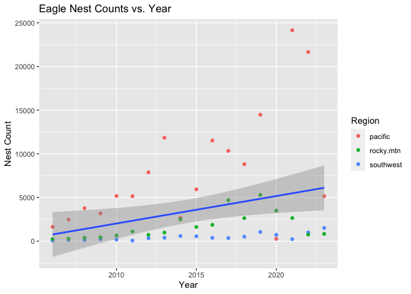

InClass_09_25
================

# Fake Eagle’s Nests Assignment

``` r
library(tidyverse)
eagle.nest <- read.csv("Datas/fake_eagle_nest_counts.csv")
```

*The data appear relatively tidy, however, one could make the argument
that each row contains multiple observations. Pivoting the data will
make it easier to graph nest counts vs. time.*

``` r
#using abs() to remove one nonsensical negative value

abs(eagle.nest) |>
  pivot_longer(
    cols = !year,
    names_to = "region",
    values_to = "nest.count"
  ) |>
  
ggplot(aes(x=year, y=nest.count)
         ) +
  geom_point(aes(color = region)) +
  geom_smooth(method ="lm") +
  labs(
    title = "Eagle Nest Counts vs. Year",
    x = "Year", y = "Nest Count",
    color = "Region"
    )
```


