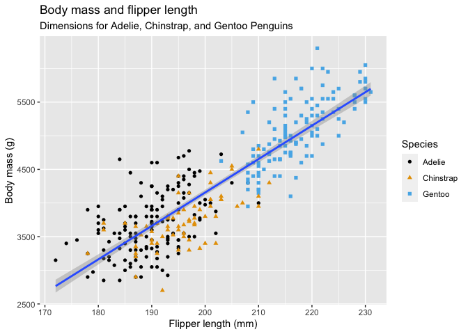

Homework 03
================

# Base R and R Basics

## Creating and naming variables

1.  Create a variable called `x` and use it to store the result of the
    calculation `(3*(4+2)`.

``` r
x <- (3*(4+2))
```

2.  Calculate the product of `x` (from the above question) times π.

``` r
x*pi
```

    [1] 56.54867

3.  Use the `getwd()` function to show your current working directory.
    Is that a good working directory, and what program do you think set
    it that way?

``` r
getwd()
```

    [1] "/Users/Jason/Documents/UT_Knoxville/MICR_575/R"

*This working directory seems appropriate; I reckon it was set by
RStudio.*

## Vectors

1.  Use the `c()` function to create a vector of numbers.

``` r
vek_nums <- c(2,4,6,8)
```

2.  Use the `c()` function to create a vector of characters.

``` r
vek_chars <- c("two", "four", "six", "ate")
```

3.  Use the `:` implicit function to create a vector of integers from 1
    to 10.

``` r
vek_ints <- c(1:10)
```

4.  Explain *why* the following code returns what it does. Also address
    whether you think this was a good decision on the part of the
    designers of R?

``` r
v1 <- 1:3
v2 <- c(1:4)
v1 + v2
```

    [1] 2 4 6 5

*R is adding the equally indexed elements of v1 and v2 together, then
recycling to the first element in v1 to add to the 4th element in v2*

5.  Explain what the following code does. It may be helpful to reference
    the answer to the previous question:

``` r
c(1, 5, 9) + 3
```

    [1]  4  8 12

*This code is adding 3 (a vector of 1 element) to each element in the
longer vector by the same recycling concept as shown in the previous
question.*

6.  Remove (delete) every variable in your workspace.

``` r
rm(list=ls())
```

## Graphics

1.  Load the tidyverse package. **NOTE:** Be sure to use the chunk
    option `message=FALSE` to suppress the messages that tidyverse
    prints when loaded.

``` r
library(tidyverse)
library(palmerpenguins)
library(ggthemes)
```

2.  Recreate the visualization of `body_mass_g` to `flipper_length_mm`,
    from the penguins data set, that is shown in question 8 of section
    2.2.5 of [R4DS](https://r4ds.hadley.nz/data-visualize).

``` r
na.omit(penguins) |>
ggplot(aes(x=flipper_length_mm, y=body_mass_g)
  ) +
  geom_point(mapping = aes(color = bill_depth_mm)) +
  geom_smooth() +
  labs(
    title = "Body mass vs. flipper length",
    subtitle = "Dimensions for Adelie, Chinstrap, and Gentoo Penguins",
    x = "Flipper length (mm)", y = "Body mass (g)",
    color = "Bill Depth (mm)"
  )
```



3.  Explain why each aesthetic is mapped at the level that it is (i.e.,
    at the global level, in the `ggplot()` function call, or at the geom
    level, in the `geom_XXX()` function call). Note: A lot of different
    options will work, but some options are clearly better than others.

*Mapping species globally has the undesirable effect of creating
distinct linear models for each cluster of species data. Mapping species
color (and shape) at the point level creates distinctly colored and
shaped data points for each group of species data, which helps to make
the graph easily interpretable.*
