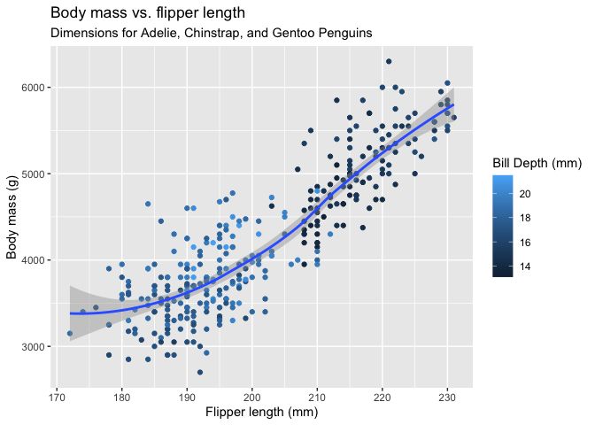

Homework 03
================

# Base R and R Basics

HINT: Remember that you can get help on any function by typing
`?`(function name). For instance, `?rnorm` gives help on the `rnorm()`
function.

## Creating and naming variables

1.  Create a variable called `x` and use it to store the result of the
    calculation `(3*(4+2)`.

``` r
x <- (3*(4+2))
```

2.  Calculate the product of `x` (from the above question) times π.

``` r
x*pi
```

    [1] 56.54867

3.  Use the `getwd()` function to show your current working directory.
    Is that a good working directory, and what program do you think set
    it that way?

``` r
getwd()
```

    [1] "/Users/Jason/Documents/UT_Knoxville/MICR_575/R"

``` r
#This working directory seems appropriate; I reckon it was set by RStudio.
```

## Vectors

1.  Use the `c()` function to create a vector of numbers.

``` r
vek_nums <- c(2,4,6,8)
```

2.  Use the `c()` function to create a vector of characters.

``` r
vek_chars <- c("two", "four", "six", "ate")
```

3.  Use the `:` implicit function to create a vector of integers from 1
    to 10.

``` r
vek_ints <- c(1:10)
```

4.  Explain *why* the following code returns what it does. Also address
    whether you think this was a good decision on the part of the
    designers of R?

``` r
v1 <- 1:3
v2 <- c(1:4)
v1 + v2
```

    [1] 2 4 6 5

``` r
#R is adding the values of the v1 and v2 together, but it's not clear to me why the 4th value of the output is "5" instead of "4".
```

5.  Explain what the following code does. It may be helpful to reference
    the answer to the previous question:

``` r
c(1, 5, 9) + 3
```

    [1]  4  8 12

``` r
# The above code is adding the constant 3 to each value in the vector.
```

6.  Remove (delete) every variable in your workspace.

``` r
rm(list=ls())
```

## Graphics

1.  Load the tidyverse package. **NOTE:** Be sure to use the chunk
    option `message=FALSE` to suppress the messages that tidyverse
    prints when loaded.

``` r
library(tidyverse)
library(palmerpenguins)
library(ggthemes)
glimpse(penguins)
```

    Rows: 344
    Columns: 8
    $ species           <fct> Adelie, Adelie, Adelie, Adelie, Adelie, Adelie, Adel…
    $ island            <fct> Torgersen, Torgersen, Torgersen, Torgersen, Torgerse…
    $ bill_length_mm    <dbl> 39.1, 39.5, 40.3, NA, 36.7, 39.3, 38.9, 39.2, 34.1, …
    $ bill_depth_mm     <dbl> 18.7, 17.4, 18.0, NA, 19.3, 20.6, 17.8, 19.6, 18.1, …
    $ flipper_length_mm <int> 181, 186, 195, NA, 193, 190, 181, 195, 193, 190, 186…
    $ body_mass_g       <int> 3750, 3800, 3250, NA, 3450, 3650, 3625, 4675, 3475, …
    $ sex               <fct> male, female, female, NA, female, male, female, male…
    $ year              <int> 2007, 2007, 2007, 2007, 2007, 2007, 2007, 2007, 2007…

2.  Recreate the visualization of `body_mass_g` to `flipper_length_mm`,
    from the penguins data set, that is shown in question 8 of section
    2.2.5 of [R4DS](https://r4ds.hadley.nz/data-visualize).

``` r
ggplot(
  data = penguins, 
       mapping = aes(x=flipper_length_mm, y=body_mass_g)
  ) +
  geom_point(mapping = aes(color = species, shape = species)) +
  geom_smooth(method = "lm") +
  labs(
    title = "Body mass and flipper length",
    subtitle = "Dimensions for Adelie, Chinstrap, and Gentoo Penguins",
    x = "Flipper length (mm)", y = "Body mass (g)",
    color = "Species", shape = "Species"
  ) +
  scale_color_colorblind()
```

    `geom_smooth()` using formula = 'y ~ x'

    Warning: Removed 2 rows containing non-finite values (`stat_smooth()`).

    Warning: Removed 2 rows containing missing values (`geom_point()`).



3.  Explain why each aesthetic is mapped at the level that it is (i.e.,
    at the global level, in the `ggplot()` function call, or at the geom
    level, in the `geom_XXX()` function call). Note: A lot of different
    options will work, but some options are clearly better than others.

``` r
#Mapping species globally has the undesirable effect of creating distinct linear models for each cluster of species data. Mapping species color and shape at the point level creates distinctly colored and shaped data points for each group of species data, which helps to make the graph easily interpretable.   
```
