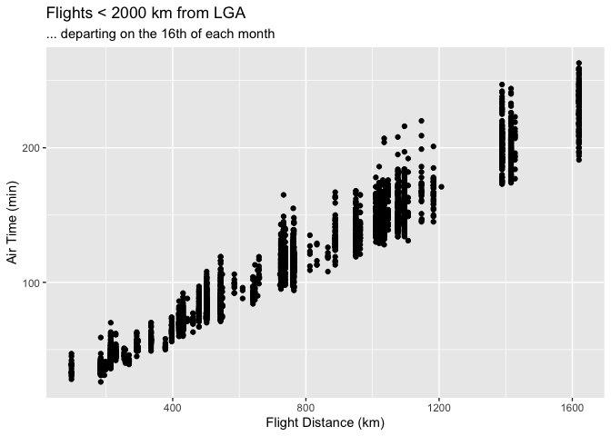
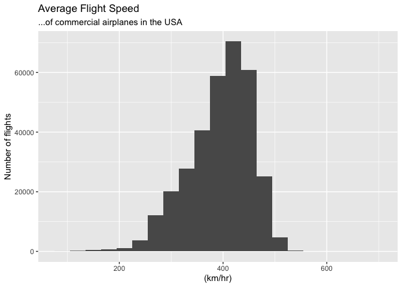

Hmk_04 template: Data frames and data wrangling
================

Please read the entire [R for Data
Science](https://r4ds.hadley.nz/data-transform) before you do this
homework.

This homework relies on the `nycflights13` package, which contains
several data frames, including `airlines`, `airports`, `flights`,
`planes`, and `weather`. Loading `nycflights13`
(`library(nycflights13)`) puts all of these data frames on the search
path.

## Installing data packages

Remember that any package needs to be installed only once (per version
of R), but needs to be loaded every time we start a new R session.

To install `nyclflights13`, use `install.packages("nycflights13")` (with
quotation marks). To load it, use `library(nycflights13)`.

# Question 1: filtering

Make a plot of air time as a function of distance (air time on the y
axis, distance on the x axis) for all flights that meet the following
criteria:

- originate from LaGuardia airport (“LGA”)
- departed on the 16th of the month
- have a flight distance of less than 2000

``` r
library(nycflights13)
library(tidyverse)

na.omit(flights) |>
  filter(
    origin == "LGA",
    day == 16,
    distance < 2000
  ) |>
  
  ggplot(
    mapping = aes(x=distance, y=air_time)
  ) +
  geom_point()+
  labs(
    title = "Flights < 2000 km from LGA",
    subtitle = "... departing on the 16th of each month",
    x = "Flight Distance (km)", y = "Air Time (min)"
  )
```



# Question 2: dealing with NAs

Make a data frame of all of the rows of `flights` that have values for
*both* `arr_time` and `dep_time` - that is, neither of those values are
`NA`.

``` r
#removing NA values from flights

flights_clean <- na.omit(flights)
```

## filtering NAs

`ggplot()` will automatically remove NA values from the plot, as you may
have seen in question 1, but it emits a warning message about that. Of
course you could silence the warning message using [chunk
options](https://bookdown.org/yihui/rmarkdown-cookbook/chunk-options.html),
but how could you prevent them from appearing in the first place?

*To prevent NA warning messages, we can use na.rm = TRUE, na.omit(),
etc*

# Question 3: adding columns

Create a data frame of average flight speeds, based on `air_time` and
`distance`. Make either a histogram or a density plot of the data. If
you like, you may break the data out (e.g. by airline, or some other
variable) in a way that you think makes sense.

``` r
#creating a new data frame with the avg_flight_speed variable, converting units from km/min to km/hr
flights_speed <- mutate(
  flights_clean,
  avg_flight_speed = 60*distance / air_time,
  .keep="used"
  )

ggplot(
  flights_speed,
  aes(x = avg_flight_speed)
  )+
  geom_histogram(binwidth = 30)+
  labs(
    title = "Average Flight Speed",
    subtitle = "...of commercial airplanes in the USA",
    x = "(km/hr)", y = "Number of flights"
  )
```


