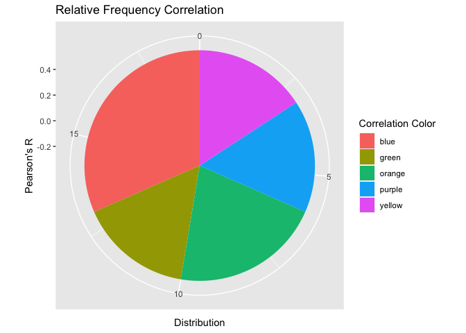

hmk_07_badplot_JLO
================

``` r
library(tidyverse)
```

    ── Attaching core tidyverse packages ──────────────────────── tidyverse 2.0.0 ──
    ✔ dplyr     1.1.3     ✔ readr     2.1.4
    ✔ forcats   1.0.0     ✔ stringr   1.5.0
    ✔ ggplot2   3.4.4     ✔ tibble    3.2.1
    ✔ lubridate 1.9.2     ✔ tidyr     1.3.0
    ✔ purrr     1.0.2     
    ── Conflicts ────────────────────────────────────────── tidyverse_conflicts() ──
    ✖ dplyr::filter() masks stats::filter()
    ✖ dplyr::lag()    masks stats::lag()
    ℹ Use the conflicted package (<http://conflicted.r-lib.org/>) to force all conflicts to become errors

``` r
rm(list=ls())

df <- tribble(
  ~color_class,"purple","purple","purple",
  "green","green","green",
  "orange","orange","orange","orange",
  "yellow","yellow","yellow",
  "blue","blue","blue","blue","blue","blue"
  )
  

ggplot(df, aes(x=0.1, fill = color_class))+
  geom_bar()+
  coord_polar(theta = "y")+
  labs(
    title = "Relative Frequency Correlation",
    x = "Pearson's R", y = "Distribution",
    fill = "Correlation Color"
  )
```



*This plot is bad because it contains a lot of nonsense, but also
because it’s a pie chart for no reason. Even the most generous
interpretation should conclude that there is a lot of unnecessary ink,
as class counts could have been reasonably displayed in a simple table.*
