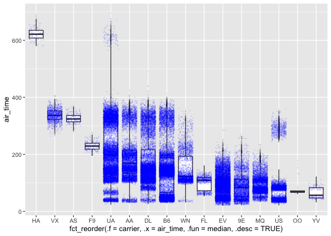

Mid-semester check-in: Part I
================

1.  Calculate the average and standard deviation of flight delays for
    each airline, *counting only those flights that were delayed longer
    than an hour*.

``` r
library(nycflights13)
library(tidyverse)

flights_b <- group_by(flights, carrier) |>
  filter(!is.na(arr_delay),
         arr_delay > 60)

summary_flights <- summarize(flights_b,
                             mean_arr_delay = mean(arr_delay),
                             sd_arr_delay = sd(arr_delay)
                             )

slice_head(ungroup(summary_flights), n=10)
```

    # A tibble: 10 × 3
       carrier mean_arr_delay sd_arr_delay
       <chr>            <dbl>        <dbl>
     1 9E                125.         63.3
     2 AA                122.         75.4
     3 AS                113.         37.8
     4 B6                117.         55.6
     5 DL                131.         89.1
     6 EV                119.         58.3
     7 F9                142.        102. 
     8 FL                138.         85.3
     9 HA                255.        412. 
    10 MQ                114.         67.7

2.  Identify the 5 flights (i.e., unique combination of `carrier` and
    `flight`) that are most frequently delayed more than a half hour.

``` r
flights_c <- group_by(flights, carrier, flight) |>
  filter(!is.na(arr_delay),
         arr_delay > 30)

summary_flights_c <- summarize(flights_c, n = n()) |>
  arrange(desc(n))

slice_head(ungroup(summary_flights_c), n=5)
```

    # A tibble: 5 × 3
      carrier flight     n
      <chr>    <int> <int>
    1 B6         527   124
    2 EV        4131   120
    3 EV        4224   113
    4 EV        4333   112
    5 EV        4204   110

3.  Make a plot of the distribution of flight times for each airline.
    The plot should show summary statistics in some way (e.g. median,
    upper and lower quartiles; you can choose which summary statistics
    are best) as well as individual data points. Order the x axis in
    order of median flight time, from highest on the left to lowest on
    the right.

``` r
flights_d <- group_by(flights, carrier) |>
  filter(!is.na(air_time))

ggplot(flights_d, 
       aes(x = fct_reorder(.f = carrier, .x = air_time, .fun = median, .desc = TRUE), 
         y = air_time)) +
  geom_boxplot(outlier.alpha = 0.1, outlier.size=0.1) +
  geom_jitter(data=slice_sample(flights_d, prop=0.3),
              color="blue", size=0.1, alpha=0.1)
```


